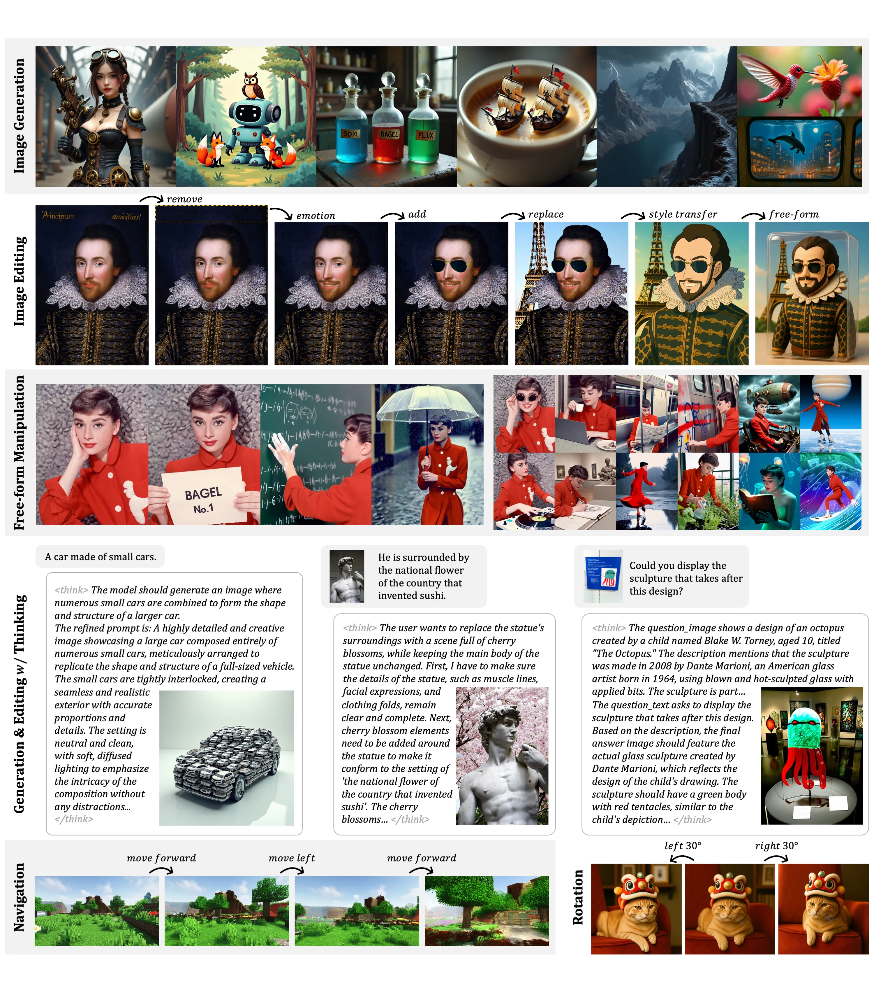
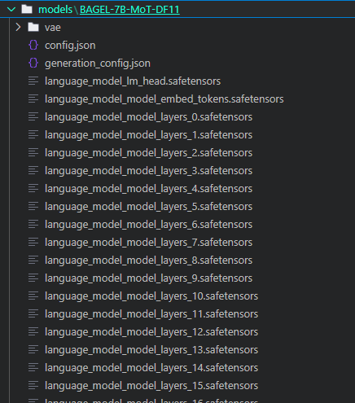
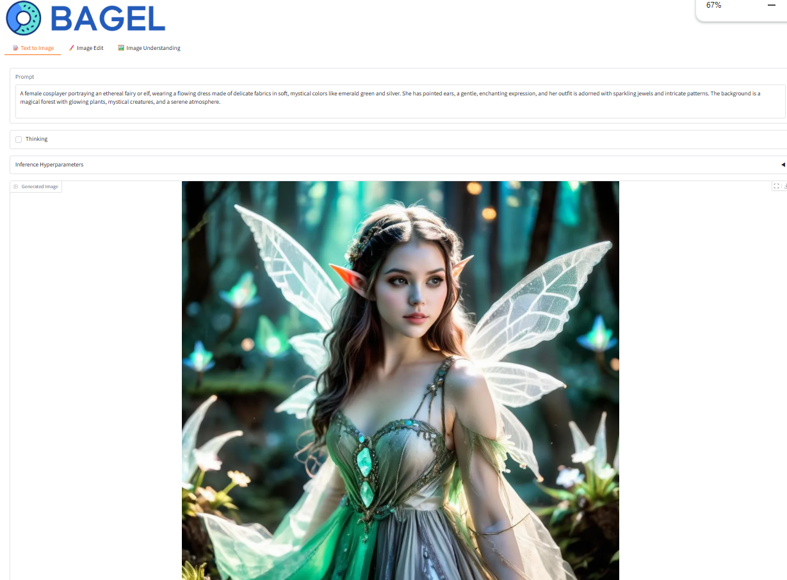

<p align="center">
  
  
</p>

# DFloat11 + BAGEL(Window)

This repository provides inference code for the [DFloat11-compressed BAGEL-7B-MoT model](https://huggingface.co/DFloat11/BAGEL-7B-MoT-DF11).

With **32% smaller size** than the original BFloat16 model, it delivers **bit-identical outputs** while maintaining efficient GPU inference. Thanks to DFloat11 compression, BAGEL can now run smoothly on a **single 24GB GPU** without any quality loss.

This version has been configured to work in a **Windows environment**.

## 📊 Performance Comparison

| Metric                             | BAGEL-7B-MoT (BFloat16) | BAGEL-7B-MoT (DFloat11) |
| ---------------------------------- | ------------------------- | ------------------------- |
| Model Size                         | 29.21 GB                  | 19.89 GB                  |
| Peak GPU Memory<br>(1024x1024 image generation) | 30.07 GB                  | 21.76 GB                  |
| Generation Time<br>(on an A100 GPU)   | 54 seconds               | 58 seconds               |

## BAGEL: Unified Model for Multimodal Understanding and Generation

**BAGEL** is an open‑source multimodal foundation model with 7B active parameters (14B total) trained on large‑scale interleaved multimodal data. BAGEL outperforms the current top‑tier open‑source VLMs like Qwen2.5-VL and InternVL-2.5 on standard multimodal understanding leaderboards, and delivers text‑to‑image quality that is competitive with strong specialist generators such as SD3.
Moreover, BAGEL demonstrates superior qualitative results in classical image‑editing scenarios than the leading open-source models. More importantly, it extends to free-form visual manipulation, multiview synthesis, and world navigation, capabilities that constitute "world-modeling" tasks beyond the scope of previous image-editing models.
The figure below showcases BAGEL's qualitative performance.

For more information, please refer to the original [BAGEL repository](https://github.com/ByteDance-Seed/Bagel).

<p align="center"></p>


## 🔥 Quick Start

1️⃣  Set up environment
```bash
git clone https://github.com/LeanModels/Bagel-DFloat11.git
cd Bagel-DFloat11
conda create -n bagel python=3.10 -y
conda activate bagel

# CUDA 12.4
pip install torch==2.6.0+cu124 torchvision --index-url https://download.pytorch.org/whl/cu124
pip install triton-windows-3.2.0.post11
pip install flash_attn-2.7.4.post1+cu124torch2.6.0cxx11abiFALSE-cp310-cp310-win_amd64.whl
pip install -r requirements.txt
```

2️⃣  Download pretrained checkpoint
Download [DFloat11/BAGEL-7B-MoT-DF11](https://huggingface.co/DFloat11/BAGEL-7B-MoT-DF11/tree/main) into the `models/` directory.



3️⃣  Go to [`inference.ipynb`](inference.ipynb) to start playing with BAGEL!

4️⃣ Use Gradio WebUI to start playing with BAGEL!
```bash
pip install gradio
python app.py
```

## 📄 Learn More

* **Paper**: [70% Size, 100% Accuracy: Lossless LLM Compression for Efficient GPU Inference via Dynamic-Length Float](https://arxiv.org/abs/2504.11651)
* **GitHub**: [https://github.com/LeanModels/DFloat11](https://github.com/LeanModels/DFloat11)
* **HuggingFace**: [https://huggingface.co/DFloat11](https://huggingface.co/DFloat11)
